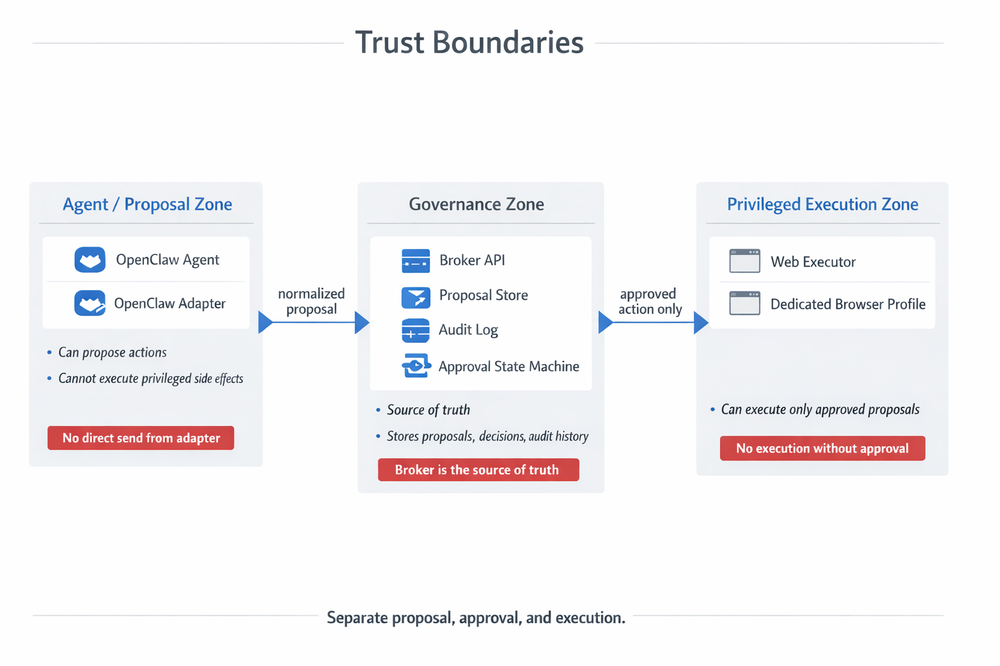

# ARCHITECTURE.md

## Overview

This project is an approval-gated action system for AI agents.

It sits between:
- an agent runtime that proposes actions
- a human who approves, edits, or rejects them
- a privileged executor that performs the real-world side effect

The first concrete flow is Gmail send/draft plus Gmail-native schedule-send.
The architecture must remain generic for future executors.

## Core principle

Separate **proposal**, **approval**, and **execution**.

That separation is the core trust boundary of the system.

## Components

### 1. `packages/core`

Shared domain logic and types.

Responsibilities:
- action kinds
- proposal schema
- status enum
- deterministic payload normalization rules
- payload hashing
- state transition rules
- shared validation helpers
- shared interfaces for executors and adapters

This package must remain provider-agnostic.

---

### 2. `apps/broker-api`

System source of truth.

Responsibilities:
- create proposals
- store normalized payloads
- store payload hashes
- track proposal status
- track approvals, edits, rejections, expiry, and execution results
- expose APIs for adapters, approval surfaces, and executors
- persist audit logs
- reject invalid transitions

The broker does not perform side effects in MVP.

---

### 3. `packages/openclaw-adapter`

Thin producer layer for agent-originated actions.

Responsibilities:
- accept agent/tool input
- normalize payloads
- compute deterministic hashes
- create proposals in broker
- return proposal IDs and preview metadata

Non-responsibilities:
- does not send email
- does not hold privileged Gmail credentials
- does not directly execute side effects

This package is intentionally thin.

---

### 4. `packages/executor-gmail-web`

Privileged side-effect executor.

Responsibilities:
- fetch approved Gmail proposals from broker
- mark them `executing`
- run a generic Gmail browser execution flow through a pluggable browser backend
- support Gmail web compose/send/schedule operations behind that backend
- prefer OpenClaw-controlled Chrome for personal deployment
- keep Playwright as an optional/reference backend
- verify success as best as practical
- write back `executed` or `failed`

This package is Gmail-specific.
Its interface should still fit a generic executor model.

## Trust boundaries

### Agent / adapter boundary

The agent may decide what to propose.
It may not directly trigger privileged execution.

The adapter is allowed to:
- create proposals

The adapter is not allowed to:
- send Gmail directly
- bypass broker approval state
- hold privileged Gmail session material

### Broker boundary

The broker is trusted to:
- persist proposals
- validate transitions
- record audit history
- expose approved work to executors

The broker is not trusted to:
- perform side effects directly in MVP

### Executor boundary

The executor is trusted to:
- perform side effects

The executor must:
- only act on approved proposals
- update broker state before and after execution
- remain isolated from the adapter

## High-level flow

### Proposal flow

1. Agent drafts an action.
2. Adapter normalizes the payload.
3. Adapter hashes the normalized payload.
4. Adapter creates a proposal in broker.
5. Broker stores proposal and audit event.

### Approval flow

1. A human reviews the proposal through an approval surface.
2. Human may:
    - approve
    - edit and approve
    - reject
    - ignore until expiry
3. Broker records the decision and audit data.

### Execution flow

1. Executor fetches approved proposals for action kinds it supports.
2. Executor marks proposal `executing`.
3. Executor performs the side effect.
4. Executor marks proposal `executed` or `failed`.
5. Broker stores execution result and audit event.

## State model

Minimum proposal statuses:

- `proposed`
- `approved`
- `rejected`
- `expired`
- `executing`
- `executed`
- `failed`

### State transition rules

Valid transitions should be explicit.

Typical valid transitions:
- `proposed -> approved`
- `proposed -> rejected`
- `proposed -> expired`
- `approved -> executing`
- `executing -> executed`
- `executing -> failed`

Invalid transitions must fail explicitly.

Examples of invalid transitions:
- `executed -> approved`
- `failed -> proposed`
- `rejected -> executing`

## Audit model

Every important event should produce an audit record.

Examples:
- proposal created
- proposal approved
- proposal edited
- proposal rejected
- proposal expired
- execution started
- execution succeeded
- execution failed

Audit records should be append-only.

## Data model

At a minimum, a proposal should include:

- `id`
- `kind`
- `status`
- normalized payload
- payload hash
- requester metadata
- timestamps
- approval metadata
- execution metadata

Future-friendly but not required in MVP:
- correlation IDs
- tags
- tenant/workspace IDs
- policy decision metadata

## Action kinds

Initial action kinds:

- `gmail.web.send_now`
- `gmail.web.schedule_send`
- `gmail.api.create_draft`

The current browser executor may implement:
- `gmail.web.send_now`
- `gmail.web.schedule_send`

Preferred personal-deployment path:
- `gmail.api.create_draft` through a Gmail API executor path
- future Gmail API-backed send-now path when native Gmail web send is unnecessary
- browser execution only when native Gmail schedule-send behavior is required
- OpenClaw-controlled Chrome session as the preferred real-account browser backend
- Playwright as an optional/reference backend
- no bulk sending, spam, service-limit bypass, or misleading automation

The core model should make it easy to add future kinds such as:
- `slack.post_message`
- `browser.submit_form`
- `api.call`
- `shell.exec_release`

## Gmail-specific design notes

### Why Gmail browser executor exists

For scheduled email, the goal is native Gmail behavior.
That means the executor should use Gmail web’s scheduling flow so the message lands in Gmail Scheduled.

The browser control mechanism should be pluggable.
For personal deployment, the preferred mechanism is an OpenClaw-controlled real Chrome session/profile rather than Playwright against a real Gmail account.

### Why not schedule in broker

Broker-side delayed delivery would create a separate scheduler product.
That is not the desired MVP behavior.

### Gmail executor inputs

A Gmail proposal should support:
- `to`
- `cc`
- `bcc`
- `subject`
- `text`
- `html`
- optional schedule:
    - `sendAt`
    - `timezone`

## Package dependency direction

Allowed dependency direction:

- `apps/broker-api -> packages/core`
- `packages/openclaw-adapter -> packages/core`
- `packages/executor-gmail-web -> packages/core`

Avoid:
- `packages/core` depending on app or executor code
- adapter depending directly on executor code
- executor depending directly on adapter code

The broker is the rendezvous point.

## Error handling principles

- Fail explicitly.
- Preserve useful debugging context.
- Do not silently downgrade risky behavior.
- Do not auto-execute when approval state is ambiguous.
- Prefer clear operational errors over hidden retries that obscure state.

## Security and operational posture

- Keep privileged Gmail session material outside the adapter.
- Use a dedicated browser profile for Gmail automation.
- Prefer OpenClaw-controlled Chrome for personal real-account browser execution.
- Treat Playwright as an optional/reference backend rather than the only architecture.
- Treat executor machines/profiles as privileged infrastructure.
- Treat approval surfaces as operator/admin surfaces.
- Never assume proposal payloads are safe without validation.
- Do not imply Google or Gmail affiliation, endorsement, or sponsorship.
- Avoid Gmail logos/icons in public diagrams unless reviewed against Google brand guidance.

## MVP boundaries

### Included
- core types and state machine
- broker API with persistence
- proposal creation
- approve / edit / reject / expiry
- audit log
- Gmail browser executor with pluggable backend
- OpenClaw-facing adapter

### Excluded from MVP
- broad policy engine
- multi-approver workflows
- escalation trees
- large custom approval UI
- fake timer scheduling for Gmail
- many executors at once

## Example end-to-end scenario

1. Agent wants to email a lead.
2. Adapter creates `gmail.web.schedule_send` proposal.
3. Broker stores proposal with scheduled time and timezone.
4. Human reviews and approves.
5. Gmail executor picks up the proposal.
6. Executor runs the generic Gmail browser flow through its configured backend.
7. Backend drives Gmail’s native schedule-send UI.
8. Executor reports success back to broker.
9. Broker stores execution result and audit trail.

## Architectural invariants

These must remain true:

- No privileged side effect without an approved proposal.
- Adapter never directly executes Gmail send.
- Broker is always the source of truth.
- Executor never acts on unapproved proposals.
- Proposal state changes are auditable.
- Core remains reusable beyond Gmail.

## Future expansion

This architecture should support future additions without redesign:

- more executors
- richer approval surfaces
- more policy metadata
- multi-step approvals
- OpenClaw-specific integration improvements
- Gmail API execution path for draft and send-now
- OpenClaw Chrome-session browser backend implementation
- support for other agent runtimes besides OpenClaw

## Summary

This system exists to enforce one rule:

**Agents can propose. Humans decide. Executors act.**

That separation is the product.
