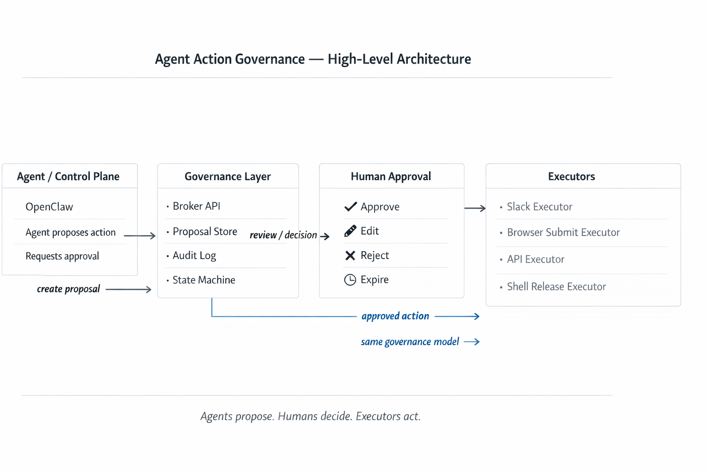

# approval-gated-actions

Approval-gated side effects for AI agents.

This repository is a pnpm TypeScript monorepo for an agent action governance system. The current MVP implements:

- `packages/core`: shared action kinds, proposal types, payload normalization, hashing, expiry helpers, and deterministic state transitions
- `apps/broker-api`: Fastify REST API with Zod validation, SQLite persistence, auditable state transitions, and health/list/query endpoints
- `packages/openclaw-adapter`: thin proposing adapter that normalizes email-action input, hashes payloads, and creates broker proposals
- `packages/executor-gmail-web`: privileged Gmail browser executor with a pluggable backend contract, a Playwright reference backend, and an OpenClaw-controlled Chrome backend path for personal deployment

## Workspace layout

- `packages/core`
- `apps/broker-api`
- `packages/openclaw-adapter`
- `packages/executor-gmail-web`

## Prerequisites

- Node.js 24+ with built-in `node:sqlite`
- pnpm 10+

## Install

```bash
pnpm install
```

## Run tests

```bash
pnpm test
```

## Run the broker API

```bash
pnpm dev:broker
```

The broker stores data in `apps/broker-api/data/broker.sqlite` by default.

## Run the Gmail browser executor

```bash
export GMAIL_EXECUTOR_BROWSER_BACKEND=openclaw
pnpm --filter @approval-gated-actions/executor-gmail-web login
pnpm --filter @approval-gated-actions/executor-gmail-web run:once
```

See [packages/executor-gmail-web/README.md](packages/executor-gmail-web/README.md) for backend selection, browser-profile, and manual Gmail setup details.

## Preferred Gmail execution path

For personal real Gmail usage:

- prefer Gmail API for draft creation and non-native send-now flows
- use browser execution only when native Gmail schedule-send behavior is required
- prefer an OpenClaw-controlled Chrome session/profile for that browser execution path
- do not use this project for bulk sending, spam, bypassing service limits, or misleading automation

## Trademark and Affiliation

This project is not affiliated with, endorsed by, or sponsored by Google or Gmail. Gmail and Google are trademarks of Google LLC. Product names are used only to describe interoperability with user-approved workflows.

## Seed demo data

```bash
pnpm seed:broker
```

## API summary

- `GET /health`
- `POST /proposals`
- `GET /proposals/:id`
- `POST /proposals/:id/approve`
- `POST /proposals/:id/reject`
- `POST /proposals/:id/executing`
- `POST /proposals/:id/executed`
- `POST /proposals/:id/failed`
- `GET /proposals?status=approved&kind=gmail.web.schedule_send`

See the package READMEs for payload and request examples.
